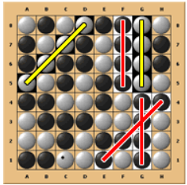

# Identificação do trabalho e do grupo

### Elementos (Grupo: Freedom_4)

- Mafalda Costa - 202006417
- Sara Moreira Reis - 202005388

### Contribuição
- Mafalda (50%)
- Sara (50%)

# Instalação e Execução:

### Requisitos
SICStus Prolog

### Execução
Abrir o SICStus Prolog e clicar em File > Consult > play.pl. Para começar o jogo, correr `play.`.

# Descrição do jogo:

*Freedom* é normalmente jogado num tabuleiro quadrado de 10x10, no entanto outros tamanhos podem ser usados para jogos mais rápidos ou longos.

O objetivo de Freedom é ter mais pedras "vivas" no final do jogo do que o adversário. Uma pedra é considerada "viva" se fizer parte de uma linha horizontal, vertical ou diagonal de exatamente 4 pedras da mesma cor.

Na ilustração abaixo, o jogador Preto vence o jogo: há 11 pedras Pretas "vivas" (fazendo parte de três linhas de 4) e 8 pedras Brancas "vivas" (fazendo parte de duas linhas de 4). Note que uma das pedras Pretas "vivas" faz parte de duas linhas de 4, mas é contada apenas uma vez.

Um jogo começa com um tabuleiro vazio.
Cada jogador tem uma cor atribuída: Branca e Preta.
A Branca joga primeiro, colocando uma pedra branca em qualquer lugar do tabuleiro.

Após este movimento, os jogadores alternam, colocando as suas pedras em células vazias adjacentes à última pedra do adversário. Se todas as células adjacentes à última pedra do adversário estiverem ocupadas, o jogador tem o direito ("liberdade") de colocar a sua pedra em qualquer célula vazia do tabuleiro.

O jogo termina quando o tabuleiro estiver cheio de pedras. O último jogador tem o direito de não jogar na sua última vez (e deixar a última célula vazia) se reduzir a sua pontuação ao colocar a última pedra .

#  Lógica do Jogo

## Loop principal de cada modo
Ficheiro: **modes.pl**.

Os 3 modos, player vs player, computador vs player e computador vs computador, recebem como argumentos `GameState`, `PlayerTurn` e `LastMove`. Na sua implementação, é executado o seguinte loop:
1) O tabuleiro do estado atual do jogo é impresso no ecrã -> `print_board(+GameState)`;
2) É verificado se o jogo acabou -> `\+ game_over(+GameState,-Winner)`. No caso afirmativo, o loop é interrompido;
3) É criada a lista de movimentos válidos para o jogador atual -> `valid_moves(+GameState, +LastMove, -ListOfMoves)`;
4) No caso de ser a vez do player, é lido e validado o input para a sua jogada -> `read_move_input(+PlayerTurn, +ListOfMoves, -NewRow, -NewCol)`;
5) No caso de ser a vez do computador, é escolhido o seu movimento, que varia a sua implementação no caso de ser um computador inteligente -> `choose_move(+GameState, +LastMove, +PlayerTurn, +Level, -Move)`;
6) É feita a nova jogada, atualizando o estado do jogo -> `move(+GameState, +Move, +PlayerTurn, -NewGameState)`;
7) Muda a vez do jogador -> `change_player(+PlayerTurn, -NewPlayerTurn)`;
8) É chamado o loop em questão novamente.

## Print board
Ficheiro: **print_board.pl**.

## Game Over
Ficheiro: **print_board.pl**.

A função `game_over(+GameState,-Winner,+Level)` verifica se o jogo está terminado ou não.
Começa por conferir se não há mais células vazias (representadas por zeros) no tabuleiro, ou seja, se o jogo acabou. Havendo apenas uma célula vazia, a continuidade do jogo depende da decisão do jogador atual. Se o jogo acabou, a função determina o vencedor, comparando os pontos de cada jogador.

A função `number_empty_cells(+GameState, -EmptyCells)` é usada para contar o número de células vazias no tabuleiro de jogo. Isto é relizado iterando o tabuleiro, a partir da função `iterate_board`, e contando quantas células são iguais a 0.

Para determinar o vencedor, a função conta o número de células ocupadas pelo jogador 1 e pelo jogador 2 que pertencem a um 4 em linha, usando `value(+GameState, +Player, -Points)`, e compara esses valores.

A função também implementa a possibilidade de continuar o jogo se houver apenas uma célula vazia no tabuleiro. Neste caso, a função `last_move(+EmptyCells, +Level, +PlayerTurn, -PlayerContinue)` é chamada para determinar se o jogador atual (o jogador a qual corresponde a última jogada) deseja continuar o jogo ou não. Se o nível do jogo for 0 (o que significa que o modo é player vs player), perguntamos ao jogador se deseja continuar ou não. Se o nível do jogo for 1 (o que significa que é jogado pelo computador random) e for a vez do computador, a continuidade é determinada aleatoriamente. Se o nível do jogo for 2 (o que significa que é jogado por um computador inteligente) e for a vez do computador, a continuidade é determinada por este de acordo com uma avaliação das jogadas disponíveis.

A função `ask_player_continue(-PlayerContinue)` pergunta ao jogador se ele deseja continuar e realizar a última jogada, introduzindo 0 no caso negativo e 1 no caso positivo. É implementada com o uso da repetição com falha (`repeat`), para garantir que o jogador responde corretamente. A função `validate_player_continue` valida a resposta do jogador, garantindo que ele introduz apenas 0 ou 1.

## Read move input
Ficheiro: **read_move_input.pl**.

A função `read_move_input(+PlayerTurn, +ListOfMoves, -NewRow, -NewCol)` é usada para ler o input da nova jogada do jogador, que corresponde à linha e coluna da célula onde ele deseja colocar a nova peça. Começa por imprimir qual é o jogador atual, com a função `write_player_turn`, e, seguidamente, lê o input do jogador, com a função `read_move_input_aux`.

A função `read_move_input_aux` lê a linha e a coluna introduzidas e verifica se são números. Se não forem números, é solicitado ao jogador que insira um novo input.

Depois de lido, a função `validate_move(+Row, +Col, +ListOfMoves)` é chamada para verificar se o movimento é válido. Verifica se a linha e a coluna introduzidas pelo jogador estão presentes na lista de movimentos válidos, que é passada como parâmetro da função. Se o movimento for inválido, a função `validate_move` imprime uma mensagem de erro, fazendo com que o loop da função `read_move_input` seja executado novamente. Se o movimento for válido, o loop é interrompido e a função `read_move_input` retorna os valores da linha e da coluna introduzidos pelo jogador.

## Choose move
Ficheiro: **logic.pl**.

## Move
Ficheiro: **move.pl**.

A função `move(+GameState, +Move, +Player, -NewGameState)` atualiza o estado do jogo com a introdução de uma nova peça de um jogador. 
O parâmetro `Move` é composto pelas coordenadas da nova peça -> `[X,Y]`. 

Começa por obter a lista que representa a linha onde estará localizada a nova peça e é criado o novo valor da célula, que é igual ao valor da peça do jogador atual, passado como parâmetro da função. Posteriormente, é chamada a função `add_piece` 2 vezes, que primeiramente insere o novo valor na posição X da lista obtida (que representa a linha) e depois insere a nova linha na lista de listas que representa o estado do jogo.

Finalmente, a função `move` retorna o novo estado do jogo com o nova peça.

## Points
Ficheiro. **points.pl**.

A função principal é `value(+GameState, +Player, -Points)`, que calcula o número de pontos de um jogador num determinado estado do jogo. Isto é feito chamando as funções `points_in_rows`, `points_in_columns` e `points_in_diagonals`, que são responsáveis por criar uma lista de peças com pontos nas linhas, colunas e diagonais do tabuleiro, respetivamente.

Cada uma dessas funções itera o tabuleiro a partir das funções `iterate_rows`, `iterate_columns` e `iterate_right_diagonals` e `iterate_left_diagonals`, respetivamente, que têm como base verificar se cada célula pertence ao jogador em questão. Nestas funções, se a célula a ser iterada pertence ao jogador, a variável `NumPieces` é incrementada, pois guarda o número de células do jogador seguidas. Uma vez que este número chega a 4, são chamadas as funções `append_rows`, `append_columns`, append_right_diagonals e append_left_diagonals, respetivamente, que adicionam a peça a ser iterada e as 3 peças imediatamente anteriormente iteradas à lista de peças com pontos. Se o `NumPieces` chega a 5 é chamada a função `take_last_4`, que retira os últimos 4 elementos da lista das peças com pontos. Se, por sua vez, uma célula não pertence ao jogador, a contagem é reiniciada.

Depois das funções `points_in_rows`, `points_in_columns` e `points_in_diagonals` serem chamadas, as listas de peças com pontos são concatenadas e as peças duplicadas são removidas, usando a função `remove_duplicates`. Finalmente, o tamanho da lista é retornado como o número de pontos do jogador.

## Menu
Ficheiro: **menu.pl**.