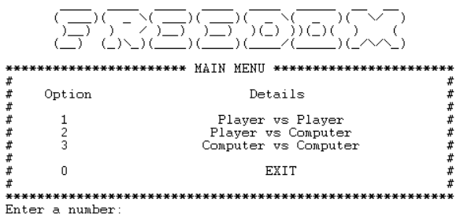
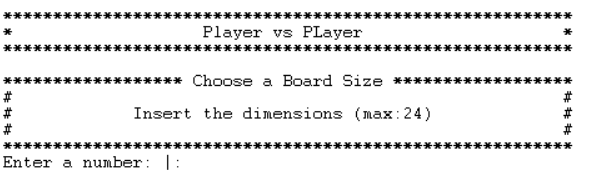
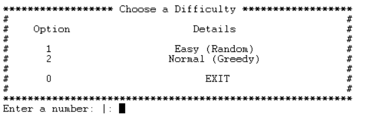
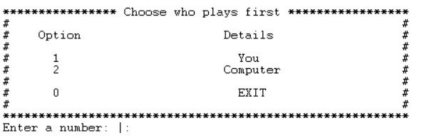

# Identificação do trabalho e do grupo

### Elementos (Grupo: Freedom_4)

- Mafalda Costa -
- Sara Moreira Reis - 202005388

### Contribuição
- Mafalda (50%)
- Sara (50%)

# Instalação e Execução:

# Descrição do jogo:

*Freedom* é normalmente jogado num tabuleiro quadrado de 10x10, no entanto outros tamanhos podem ser usados para jogos mais rápidos ou longos.

O objetivo de Freedom é ter mais pedras "vivas" no final do jogo do que o adversário. Uma pedra é considerada "viva" se fizer parte de uma linha horizontal, vertical ou diagonal de exatamente 4 pedras da mesma cor.

Na ilustração abaixo, o jogador Preto vence o jogo: há 11 pedras Pretas "vivas" (fazendo parte de três linhas de 4) e 8 pedras Brancas "vivas" (fazendo parte de duas linhas de 4). Note que uma das pedras Pretas "vivas" faz parte de duas linhas de 4, mas é contada apenas uma vez.

Um jogo começa com um tabuleiro vazio.
Cada jogador tem uma cor atribuída: Branca e Preta.
A Branca joga primeiro, colocando uma pedra branca em qualquer lugar do tabuleiro.

Após este movimento, os jogadores alternam, colocando as suas pedras em células vazias adjacentes à última pedra do adversário. Se todas as células adjacentes à última pedra do adversário estiverem ocupadas, o jogador tem o direito ("liberdade") de colocar a sua pedra em qualquer célula vazia do tabuleiro.

O jogo termina quando o tabuleiro estiver cheio de pedras. O último jogador tem o direito de não jogar na sua última vez (e deixar a última célula vazia) se reduzir a sua pontuação ao colocar a última pedra .

# Lógica do Jogo

## Representação interna do estado do jogo

## Visualização do estado de jogo

O predicado utilizado para visualizar o estado atual do jogo é o *display_game(+GameState)*. Este recebe o valor *GameState*, uma lista de listas com os valores 1 (peças do jogador 1), -1 (peças do jogador 2) ou 0 (casa vazia do tabuleiro). Em primeiro lugar, o predicado confirma que o tabuleiro recebido é, de facto quadrangular (tal como indica as regras do jogo), e só então imprime as limitações do tabuleiro assim como as legendas das colunas. De seguida, é chamada o predicado *print_matrix(+GameState,+Iterator,+Lines)* que imprime todas as linhas do tabuleiro com as peças, incluindo a legenda dessa mesma linha.

O jogo implementado permite também a criação de um tabuleiro flexível, dando a possibilidade aos jogadores de escolherem as dimensões do mesmo (4-24). Para tal é usada a função *initial_state(Size, GameState)* que, dadas as dimensões desejadas, constrói uma lista de listas com o valor 0 (representativo da célula vazia).

Para poder decidir o tipo de jogo que pretende jogar, implementámos também um menu que permite escolher entre os três tipos de jogo disponíveis (Jogador vs Jogador - PxP; Jogador vs Computador - PxC ; Computador vs Computador - CxC):

Para todos eles mostrámos o seguinte menu onde é possível escolher as dimensões do tabuleiro:

Para os jogos Jogador vs Computador - PxC e Computador vs Computador - CxC), mostrámos também o menu onde é possível selecionar a dificuldade dos computadores:

Finalemente, para o jogo Jogador vs Computador - PxC, mostrámos também o seguinte menu que permite escolher se o Jogador pretende jogar primeiro ou não:~

Nos menus implementámos também um mecanismo de prevenção de erros, onde apenas era permitido ao jogador selecionar as opções válidas; caso inserisse uma opção inválida era-lhe pedido que reintroduzisse a sua opção. Para além disso, em grande parte destes menus damos a possibilidade ao jogador de sair do programa inserindo o valor zero. 

## Execução de Jogadas

## Lista de Jogadas Válidas

Para determinar a lista de jogadas válidas utilizámos o predicado  *valid_moves(+GameState, +LastMove, -ListOfMoves)* que primeiro verifica se existem casas vazias adjacentes à última jogada. Caso assim seja, retorna a lista com essas células; senão o jogador pode jogar para qualque vazia do tabuleiro, pelo que é retornada uma lista com todas as casas vazias do mesmo.

## Final do Jogo

## Avaliação do Tabuleiro

## Jogada do Computador

Existem dois níveis possíveis para os computadores (bots) e, para escolherem as suas jogadas, foi utilizado o predicado *choose_move(+GameState, +LastMove, +Player, +Level, -Move)*. Para o nível 1 foi implementado um bot que escolhia aleatóriamente a sua próxima jogada dentro da lista de jogadas possíveis. Para o nível 2, o bot escolhia a jogada que mais pontos lhe daria no momento, escolhendo uma abordagem *greedy*. Para tal, determinava-se a lista de jogadas possíveis no momento, juntamente com os pontos que ele possuía e, para todas as jogadas possíveis, verificava-se se a sua pontuação aumentava, mantinha-se ou diminuía. Assim, asseguramos que este bot escolhe a jogada que lhe dá mais pontos no momneto ou, no mínimo, que não decresce a sua pontuação atual.

# Conclusões

# Bibliografia

Recursos utlizados:

- https://www.swi-prolog.org/
- https://www.youtube.com/watch?v=SwoZabsIzRg&ab_channel=ThePowerofProlog

